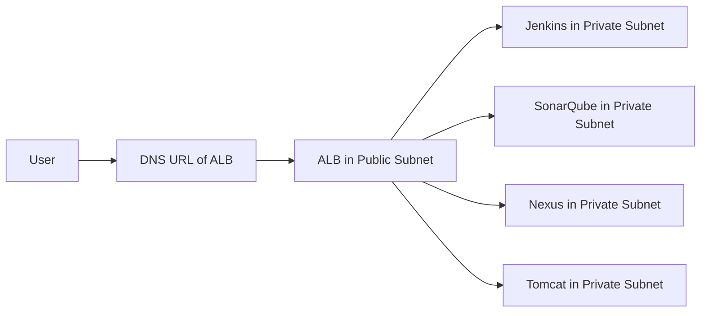

# 🛠️ DevOps CI/CD Architecture – AWS | Jenkins | SonarQube | Nexus | Tomcat

This repository demonstrates a complete CI/CD pipeline on AWS infrastructure using industry-standard DevOps tools. The architecture is designed with production-grade principles including public/private subnets, ALB routing, artifact/version control, and secure deployments.

---

## 📌 End-to-End Workflow Overview

---

## 🔄 Workflow Description
## User Access

User hits the ALB DNS URL in browser.

ALB routes requests to appropriate target based on port listener (8080 for Jenkins, 8081 for Tomcat, etc.).

## Public Subnet

Contains the Application Load Balancer (ALB) and NAT Gateway.

ALB acts as a central traffic manager.

NAT Gateway enables outbound internet access for private EC2 instances.

## Private Subnet

Jenkins handles CI pipeline and manages all automation.

SonarQube performs static code analysis during the Jenkins pipeline.

Nexus stores versioned build artifacts (WAR files).

Tomcat is the final deployment environment for the application.

## CI/CD Pipeline Flow

Jenkins pulls code from GitHub.

Runs tests and compiles the code.

Sends code to SonarQube for quality analysis.

Generates a .war artifact and pushes it to Nexus.

Fetches the artifact and deploys it to Tomcat automatically.

---

